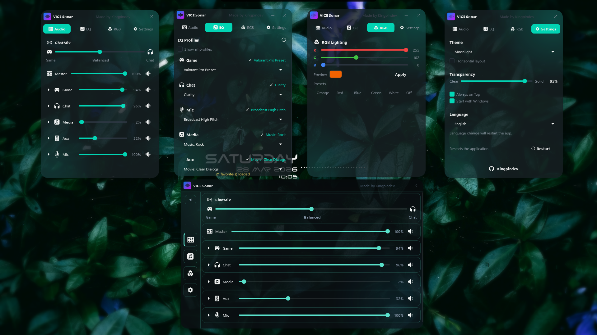
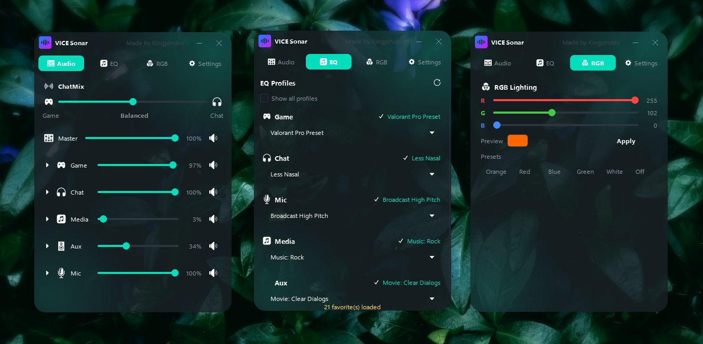
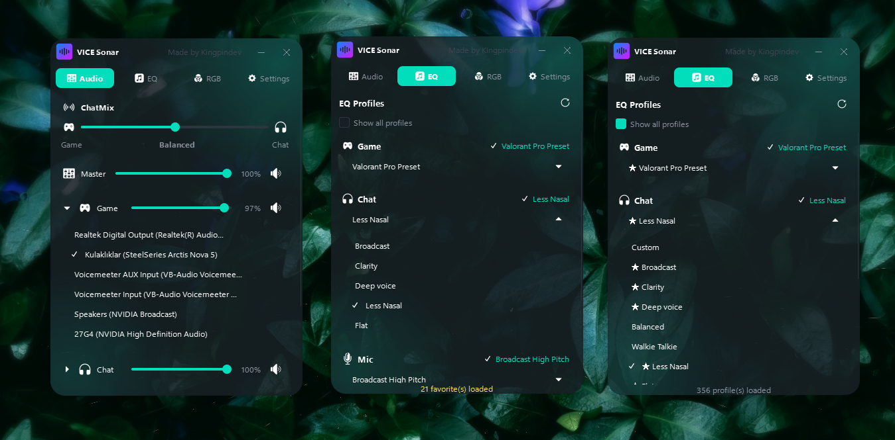
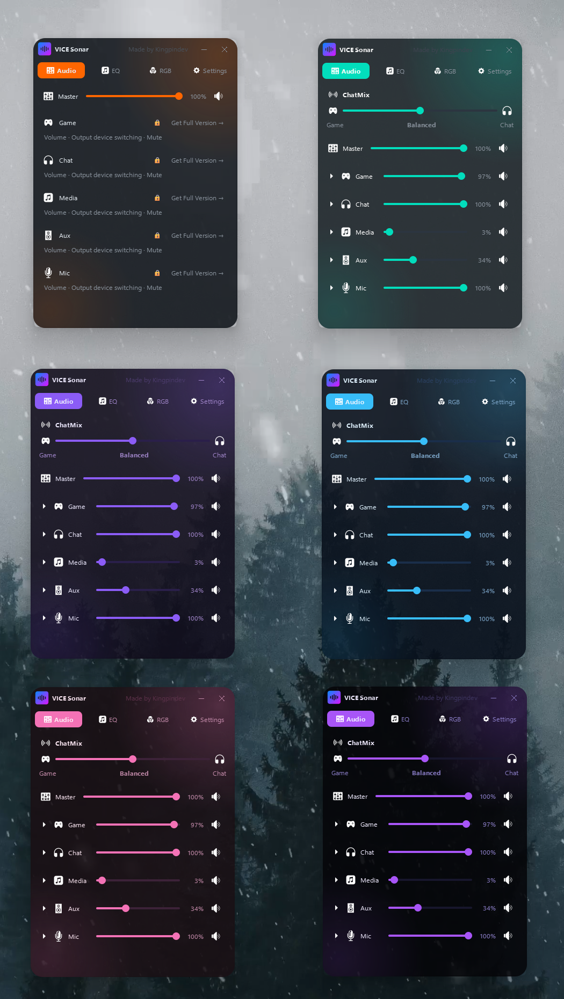
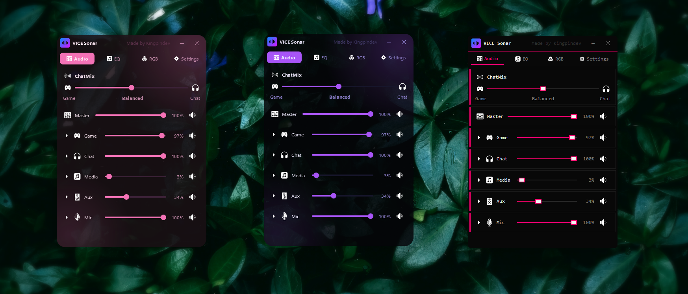
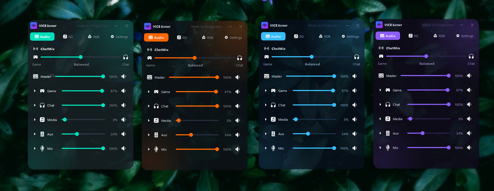
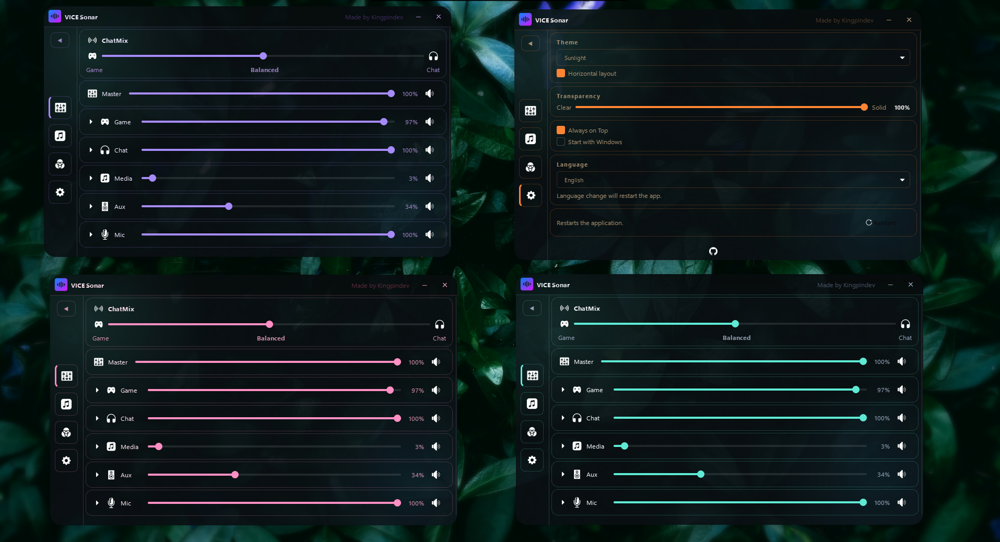

# VICE Sonar — SteelSeries Sonar Desktop Widget

  

  <strong>A sleek, always-on-top desktop widget for SteelSeries GG Sonar</strong> 
  Control your Sonar audio mixer, EQ profiles, and RGB lighting — without ever opening the main app.

  
  &nbsp;
  
  &nbsp;
  

> **VICE Sonar** is a free Windows desktop widget that gives you instant access to [SteelSeries Sonar](https://steelseries.com/gg/sonar) — volume sliders, ChatMix, EQ presets, and GameSense RGB — all in a compact, always-on-top overlay. No need to open SteelSeries GG.

---

## ⬇️ Download

  
  &nbsp;&nbsp;
  

| | Lite (Free) | Full (Store) |
|---|:---:|:---:|
| Master volume & mute | ✅ | ✅ |
| EQ profiles (favorites) | ✅ | ✅ |
| RGB lighting (GameSense) | ✅ | ✅ |
| Bubble mode & system tray | ✅ | ✅ |
| 7 interface languages | ✅ | ✅ |
| ChatMix balance | ❌ | ✅ |
| All audio channels + output switching | ❌ | ✅ |
| All EQ profiles | ❌ | ✅ |

---

## 📸 Screenshots

  

  <em>Audio &nbsp;·&nbsp; EQ Profiles &nbsp;·&nbsp; RGB Lighting</em>

  

  <em>Output device switching &nbsp;·&nbsp; All EQ profiles (Full version)</em>

  

  <em>7 built-in themes — Sunlight, Moonlight, Orbit, Aqua, Eris, Cyber, Spider Lily</em>

  

  <em>Spider Lily &nbsp;·&nbsp; Cyber &nbsp;·&nbsp; Orbit</em>

  

  <em>Moonlight &nbsp;·&nbsp; Sunlight &nbsp;·&nbsp; Aqua &nbsp;·&nbsp; Eris</em>

  

  <em>Horizontal layout &amp; Settings panel</em>

---

## ✨ Features

### 🔊 Audio Controls
- **Per-channel volume sliders** — Master, Game, Chat, Media, Aux, Mic
- **Mute toggles** on every channel
- **ChatMix slider** — hardware-synced Game/Chat balance with live label
- **Per-channel output device selector** — switch devices on the fly
- Channels **collapse and expand** to keep things clean

### 🎛️ EQ Profiles
- Instantly apply your **saved Sonar EQ presets** per device
- Separate pickers for **Game, Chat, Mic, Media, Aux**
- Active preset highlighted with a checkmark
- **Reload** button refreshes presets without restarting

### 💡 RGB Lighting
- **R / G / B sliders** with live color preview
- One-click presets: Orange, Red, Blue, Green, White, Off
- Sends colors directly to devices via **GameSense**

### ⚙️ Settings
- **7 themes** — Sunlight, Moonlight, Orbit, Aqua, Eris, Cyber, Spider Lily
- **Horizontal layout** toggle — widescreen friendly
- **Transparency slider** — 40% to 100% opacity
- **Always on Top** toggle
- **Start with Windows** option
- **7 languages** — Türkçe, English, Français, Русский, Deutsch, Español, العربية
- **Restart** button to apply changes instantly

### 🖥️ UI & UX
- Fully **borderless and draggable** — sits anywhere on screen
- **Bubble mode** — minimize to a floating always-on-top circle
- **Position memory** — remembers where you placed it
- **Instant tab switching** — all panels stay loaded in the background
- **System tray** — hide/show, topmost toggle, restart, quit
- No taskbar entry — completely out of your way

---

## 📋 Requirements

- Windows 10 or 11
- [SteelSeries GG](https://steelseries.com/gg) installed and running with Sonar active

---

## 🔧 Installation

1. Download `ViceSonar_Setup_v3.4.2.exe` from [Releases](../../releases/latest)
2. Run the installer and follow the wizard
3. Launch **VICE Sonar** from your desktop or Start Menu

The uninstaller is included — accessible from **Windows Settings → Apps**.

---

## 🔍 Keywords

`SteelSeries Sonar` · `SteelSeries GG` · `ChatMix` · `audio mixer widget` · `GameSense RGB` · `EQ profiles` · `Windows audio control` · `SteelSeries overlay` · `desktop widget Windows 11` · `SteelSeries Sonar alternative`

---

Made by <strong>Kingpindev</strong>

