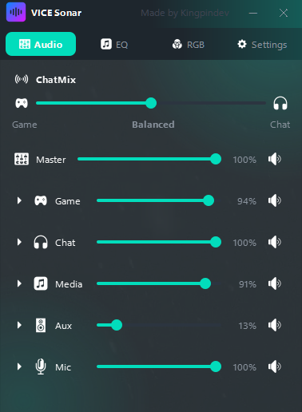
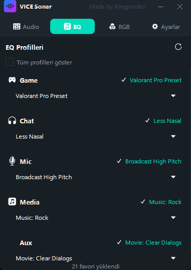
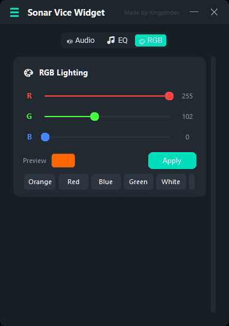
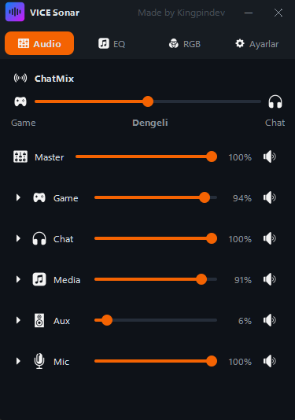
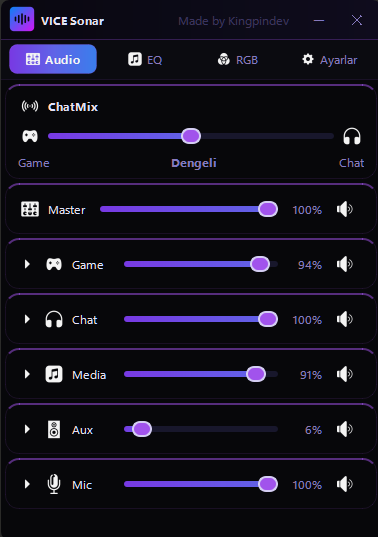
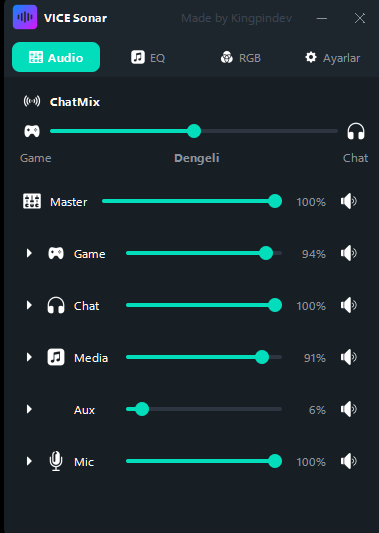
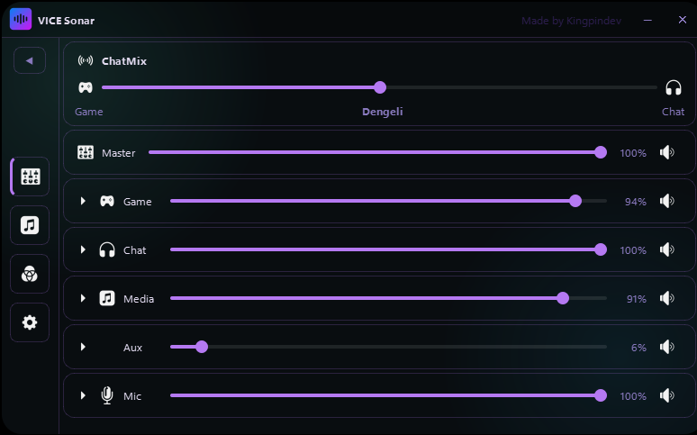
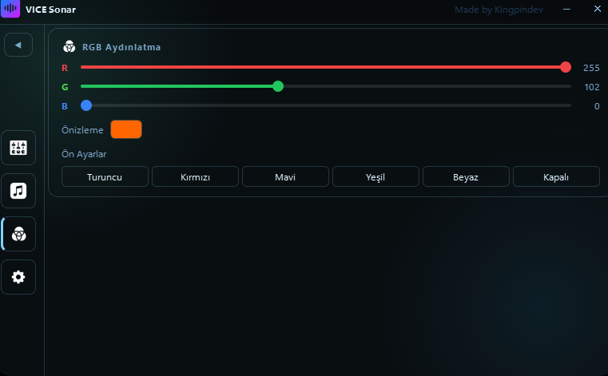
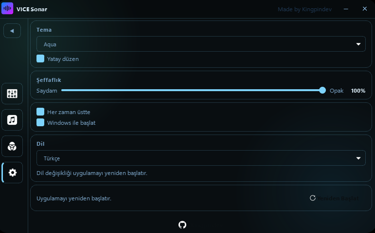

# VICE Sonar

  

  <strong>A sleek, always-on-top desktop widget for SteelSeries GG</strong> 
  Control your Sonar audio, EQ profiles, and RGB lighting — without ever opening the main app.

  
  &nbsp;
  
  &nbsp;
  

---

## ⬇️ Download

  

Grab **`ViceSonar_Setup_v1.0.0.exe`** from the [Releases](../../releases/latest) page and run it.
No Python, no manual setup — the installer handles everything.

---

## 📸 Screenshots

### Panels

  
  &nbsp;
  
  &nbsp;
  

  <em>Audio &nbsp;·&nbsp; EQ Profiles &nbsp;·&nbsp; RGB Lighting</em>

### Themes

  
  &nbsp;
  
  &nbsp;
  
  &nbsp;
  

  <em>Moonlight &nbsp;·&nbsp; Sunlight &nbsp;·&nbsp; Eris &nbsp;·&nbsp; Glassmorphic &nbsp;·&nbsp; <strong>+3 more</strong></em>

### Horizontal Layout

  
  &nbsp;
  

  

  <em>Every theme supports a horizontal widescreen layout</em>

---

## ✨ Features

### 🔊 Audio Controls
- **Per-channel volume sliders** — Master, Game, Chat, Media, Aux, Mic
- **Mute toggles** on every channel
- **ChatMix slider** — hardware-synced Game/Chat balance with live label
- **Per-channel output device selector** — switch devices on the fly
- Channels **collapse and expand** to keep things clean

### 🎛️ EQ Profiles
- Instantly apply your **saved Sonar EQ presets** per device
- Separate pickers for **Game, Chat, Mic, Media, Aux**
- Active preset highlighted with a checkmark
- **Reload** button refreshes presets without restarting

### 💡 RGB Lighting
- **R / G / B sliders** with live color preview
- One-click presets: Orange, Red, Blue, Green, White, Off
- Sends colors directly to devices via **GameSense**

### ⚙️ Settings
- **7 themes** — Sunlight, Moonlight, Orbit, Aqua, Eris, Cyber, Spider Lily
- **Horizontal layout** toggle — widescreen friendly
- **Transparency slider** — 40% to 100% opacity
- **Always on Top** toggle
- **Start with Windows** option
- **7 languages** — Türkçe, English, Français, Русский, Deutsch, Español, العربية
- **Restart** button to apply changes instantly

### 🖥️ UI & UX
- Fully **borderless and draggable** — sits anywhere on screen
- **Position memory** — remembers where you placed it
- **Instant tab switching** — all panels stay loaded in the background
- **System tray** — hide/show, topmost toggle, restart, quit
- No taskbar entry — completely out of your way

---

## 📋 Requirements

- Windows 10 or 11
- [SteelSeries GG](https://steelseries.com/gg) installed and running with Sonar active

---

## 🔧 Installation

1. Download `ViceSonar_Setup_v1.0.0.exe` from [Releases](../../releases/latest)
2. Run the installer and follow the wizard
3. Launch **VICE Sonar** from your desktop or Start Menu

The uninstaller is included — accessible from **Windows Settings → Apps**.

---

Made by <strong>Kingpindev</strong>

